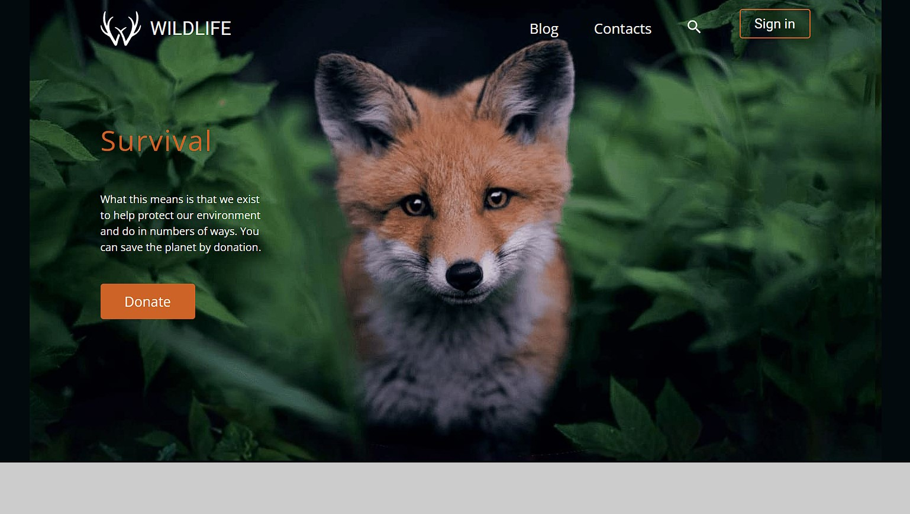

# Wildlife

Main resolution: 1440px;
Responsive? Yes

## Why this project?

I got this project at the RS School course. This is the first site that I have made up according to the layout. It's simple but stylish. In it, I used SASS to increase the speed of development. I also added an adaptive for mobile viewing.

[Layout source](https://www.figma.com/file/dJoqHi1YHTLR06PPEeCc7t/Wildlife?node-id=0%3A1)